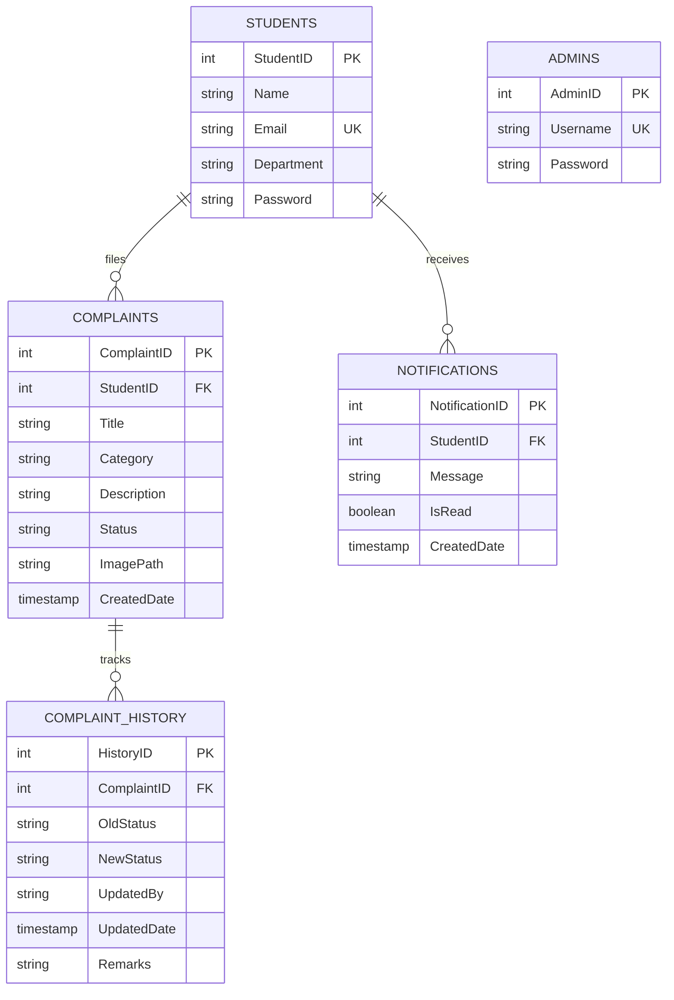

# Entity Relationship (ER) Diagram

This diagram visualizes the relational structure of the ShaktiDB tables used in the Digital Complaint Management System.

```mermaid
erDiagram
    STUDENTS {
        int StudentID PK
        string Name
        string Email UK
        string Department
        string Password
    }
    ADMINS {
        int AdminID PK
        string Username UK
        string Password
    }
    COMPLAINTS {
        int ComplaintID PK
        int StudentID FK
        string Title
        string Category
        string Description
        string Status
        string ImagePath
        timestamp CreatedDate
    }
    COMPLAINT_HISTORY {
        int HistoryID PK
        int ComplaintID FK
        string OldStatus
        string NewStatus
        string UpdatedBy
        timestamp UpdatedDate
        string Remarks
    }
    NOTIFICATIONS {
        int NotificationID PK
        int StudentID FK
        string Message
        boolean IsRead
        timestamp CreatedDate
    }

    STUDENTS ||--o{ COMPLAINTS : "files"
    STUDENTS ||--o{ NOTIFICATIONS : "receives"
    COMPLAINTS ||--o{ COMPLAINT_HISTORY : "tracks"
```
