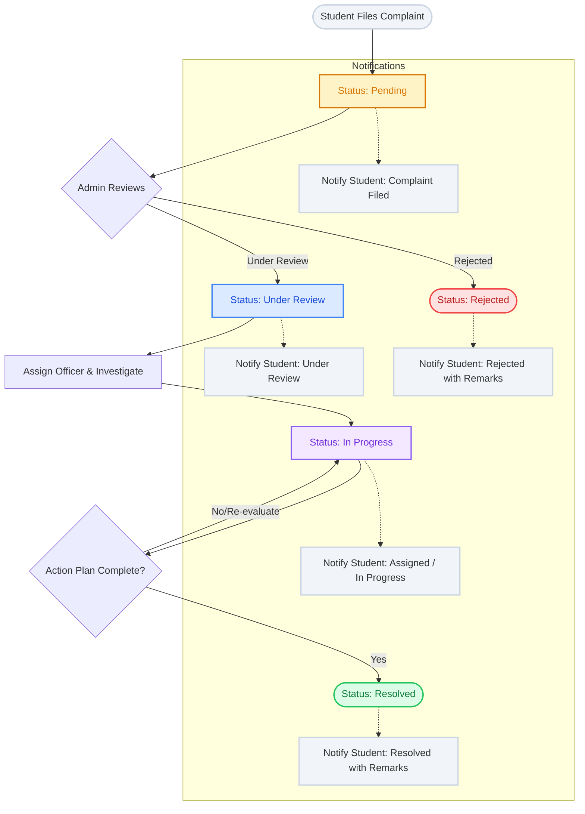

# System Workflow Flowchart

This diagram maps out the complaint lifecycle workflow and user actions in the system.

```mermaid
graph TD
    Start([Student Files Complaint]) --> Pending[Status: Pending]
    
    Pending --> AdminReview{Admin Reviews}
    
    AdminReview -->|Under Review| UnderReview[Status: Under Review]
    AdminReview -->|Rejected| Rejected([Status: Rejected])
    
    UnderReview --> Assign[Assign Officer & Investigate]
    Assign --> InProgress[Status: In Progress]
    
    InProgress --> Resolution{Action Plan Complete?}
    
    Resolution -->|Yes| Resolved([Status: Resolved])
    Resolution -->|No/Re-evaluate| InProgress
    
    subgraph Notifications
        Pending -.-> Notif1[Notify Student: Complaint Filed]
        UnderReview -.-> Notif2[Notify Student: Under Review]
        InProgress -.-> Notif3[Notify Student: Assigned / In Progress]
        Resolved -.-> Notif4[Notify Student: Resolved with Remarks]
        Rejected -.-> Notif5[Notify Student: Rejected with Remarks]
    end
    
    classDef state fill:#f1f5f9,stroke:#cbd5e1,stroke-width:2px;
    classDef green fill:#dcfce7,stroke:#22c55e,stroke-width:2px,color:#15803d;
    classDef red fill:#fee2e2,stroke:#ef4444,stroke-width:2px,color:#b91c1c;
    classDef yellow fill:#fef3c7,stroke:#d97706,stroke-width:2px,color:#d97706;
    classDef blue fill:#dbeafe,stroke:#3b82f6,stroke-width:2px,color:#1d4ed8;
    classDef purple fill:#f3e8ff,stroke:#8b5cf6,stroke-width:2px,color:#6d28d9;
    
    class Start,Notif1,Notif2,Notif3,Notif4,Notif5 state;
    class Pending yellow;
    class UnderReview blue;
    class InProgress purple;
    class Resolved green;
    class Rejected red;
```
